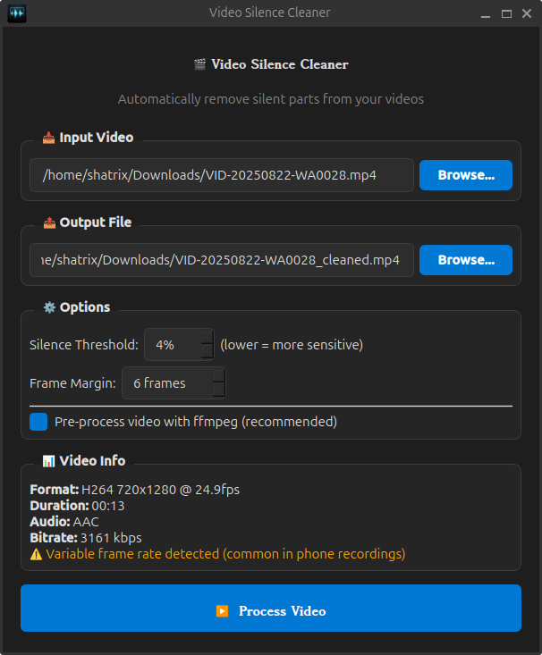

# 🎬 Video Silence Cutter

A Linux desktop application that automatically removes silent parts from videos using [auto-editor](https://auto-editor.com/).



## ✨ Features

- **Automatic silence detection** - Uses audio analysis to find and remove silent parts
- **Smart preprocessing** - Converts videos to compatible format with ffmpeg
- **Modern dark UI** - Clean, intuitive PyQt6 interface
- **Video analysis** - Shows format, resolution, duration, and bitrate info
- **Configurable options** - Adjust silence threshold and frame margins
- **Desktop integration** - Appears in your Linux application menu

## 📋 Requirements

- Linux (Ubuntu, Debian, Fedora, Arch, or similar)
- ffmpeg
- auto-editor

## 🚀 Installation

### Option A: Download Binary (Easiest)

1. **Download** `video-silence-cutter` from [Releases](https://github.com/shatrix/video-silence-cutter/releases)

2. **Install dependencies:**
   ```bash
   # Ubuntu/Debian
   sudo apt install ffmpeg auto-editor
   
   # Fedora
   sudo dnf install ffmpeg auto-editor
   
   # Arch Linux
   sudo pacman -S ffmpeg
   pip install auto-editor
   ```

3. **Run the app:**
   ```bash
   chmod +x video-silence-cutter
   ./video-silence-cutter
   ```

---

### Option B: Build from Source

1. **Install auto-editor:**
   ```bash
   # Ubuntu/Debian
   sudo apt install ffmpeg auto-editor
   
   # Fedora
   sudo dnf install ffmpeg auto-editor
   
   # Arch Linux (use pip for auto-editor)
   sudo pacman -S ffmpeg
   pip install auto-editor
   ```

2. **Clone and run setup:**
   ```bash
   git clone https://github.com/shatrix/video-silence-cutter.git
   cd video-silence-cutter
   chmod +x setup.sh
   ./setup.sh
   ```

The setup script will:
- ✅ Check for ffmpeg and auto-editor
- ✅ Create a Python virtual environment
- ✅ Install PyQt6 for the GUI
- ✅ Create a launcher script
- ✅ Add the app to your application menu

## 🎯 Usage

### Running the App

**If you downloaded the binary:**
```bash
./video-silence-cutter
```

**If you installed from source:**
- Find **"Video Silence Cutter"** in your application menu, or run:
```bash
./launch.sh
```

### Workflow

1. **Select input video** - Click "Browse" to choose a video file
2. **Output path** - Automatically suggested with `_cleaned.mp4` suffix
3. **Adjust options** (optional):
   - **Silence Threshold**: Audio level below which is considered silence (default: 4%)
   - **Frame Margin**: Buffer frames around loud sections for natural cuts (default: 6)
   - **Pre-process**: Enable ffmpeg conversion for maximum compatibility (recommended)
4. **Click "Process Video"** and wait for completion

## ⚙️ Options Explained

| Option | Default | Description |
|--------|---------|-------------|
| **Silence Threshold** | 4% | Lower = more sensitive to quiet sounds |
| **Frame Margin** | 6 frames | Adds padding around loud sections for natural transitions |
| **Pre-process** | On | Converts video with ffmpeg before processing (fixes compatibility issues) |
| **Encoding Speed** | Balanced | Trade-off between encoding time and file size (Fastest → Best Quality) |
| **GPU Hardware Encoding** | Auto | Uses NVIDIA NVENC, Intel QSV, or AMD VAAPI if available for faster processing |
| **Preserve Source Quality** | Off | Match original video bitrate instead of compressing (larger output files) |

## 🔧 How It Works

```
Input Video → FFmpeg Pre-process → Auto-Editor → Cleaned Output
                    ↓                    ↓
            Normalizes format     Removes silence
            Fixes audio issues    Keeps speech/sound
```

1. **FFmpeg preprocessing** converts the video to a standard H.264 format with normalized colorspace
2. **Auto-editor** analyzes audio levels and removes sections below the silence threshold
3. **Output** is saved to your chosen location

## 🐛 Troubleshooting

### "auto-editor failed"
- Make sure your video has an audio track
- Ensure "Pre-process video with ffmpeg" is enabled
- Try adjusting the silence threshold

### App crashes on startup
- Run from terminal to see error messages: `./launch.sh`
- Ensure PyQt6 is properly installed in the venv

### No sound in output
- Check that the input video has audio
- The app requires an audio track for silence detection

## 📁 Project Structure

```
video_silence_cleaner/
├── setup.sh                    # Installation script
├── launch.sh                   # App launcher (auto-generated)
├── video_silence_cleaner.py    # Main application
├── requirements.txt            # Python dependencies (PyQt6)
├── icon.png                    # App icon
├── screenshot.png              # App screenshot
├── README.md                   # This file
└── venv/                       # Python virtual environment
```

## 🤝 Contributing

Contributions are welcome! Please feel free to submit a Pull Request.

## 📄 License

MIT License - feel free to use and modify!

## 🙏 Credits

- [auto-editor](https://github.com/WyattBlue/auto-editor) - The core silence detection engine
- [FFmpeg](https://ffmpeg.org/) - Video preprocessing
- [PyQt6](https://www.riverbankcomputing.com/software/pyqt/) - GUI framework
